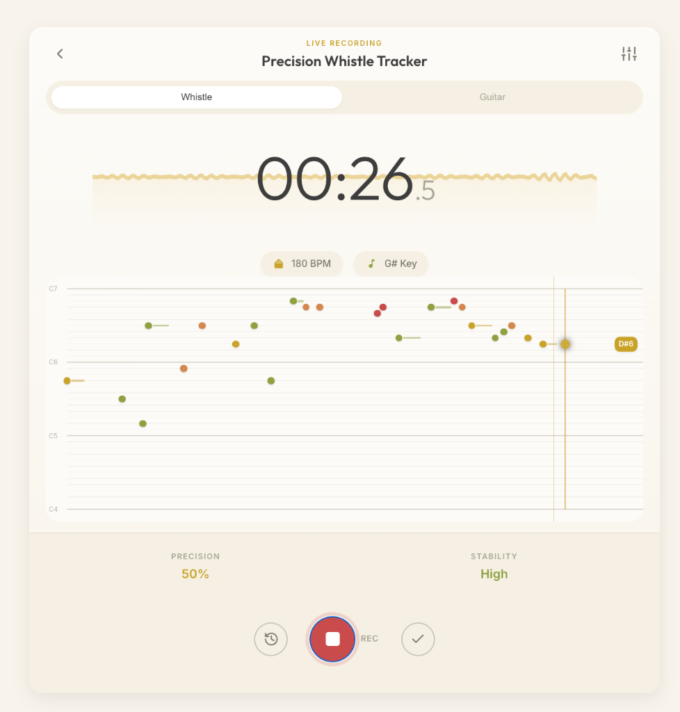

# WhistleNote 🎵

Real-time pitch detection web app that transforms your whistling or guitar playing into written music. Built with React, TypeScript, and the Web Audio API.

**[Live Demo](https://shihanqu.github.io/Whistle-Note/)**



## ✨ Features

### Real-time Pitch Detection
- **Autocorrelation-based algorithm** for accurate melody extraction
- Works with whistling, humming, and guitar
- Sub-semitone precision with cents deviation display

### Automatic Key Detection
- **Krumhansl-Schmuckler algorithm** for harmonic key detection
- Real-time key estimation as you play
- Major and minor key recognition

### Tempo Estimation
- **Intelligent BPM detection** from audio onset strength
- Beat tracking and quantization
- Real-time tempo updates

### Melody Extraction
- **Continuous pitch tracking** with note segmentation
- Duration-aware note detection
- Phrase boundary detection

### Chord Detection
- **Harmonic analysis** with chord progression generation
- Roman numeral notation
- Diatonic chord suggestions based on detected key

### Beautiful UI
- Warm, elegant cream and gold color scheme
- Piano-roll style note visualization
- Real-time waveform display
- Accuracy and stability meters

## 🚀 Getting Started

### Prerequisites
- Node.js 18+ 
- A microphone

### Installation

```bash
# Clone the repository
git clone https://github.com/shihanqu/Whistle-Note.git
cd Whistle-Note

# Install dependencies
npm install

# Start development server
npm run dev
```

#The development server will be available at `http://localhost:5173`.

This project is configured for deployment to GitHub Pages using the `gh-pages` package:

1. The site is hosted at: [https://shihanqu.github.io/Whistle-Note/](https://shihanqu.github.io/Whistle-Note/)
2. To deploy updates, run: `npm run deploy`
3. Ensure the repository settings (Settings → Pages) are set to deploy from the `gh-pages` branch.

**Important**: Update the `base` path in `vite.config.ts` to match your repository name:

```typescript
base: process.env.NODE_ENV === 'production' ? '/your-repo-name/' : '/',
```

## 🎸 Usage

1. Click "Enable Microphone" to grant audio access
2. Select your input mode (Whistle or Guitar)
3. Press the record button to start
4. Whistle or play your guitar
5. Watch as your melody is transcribed in real-time
6. View detected BPM, key, and note accuracy

## 🔧 Technical Details

### Audio Processing
- Uses the Web Audio API with `AnalyserNode` for real-time audio analysis
- FFT size: 2048 samples for frequency resolution
- Pitch detection via autocorrelation with parabolic interpolation

### Key Detection Algorithm
The Krumhansl-Schmuckler algorithm works by:
1. Building a pitch-class histogram from detected notes
2. Comparing against pre-computed major/minor key profiles
3. Finding the highest correlation match

### Tempo Detection
1. Detect note onsets using spectral flux
2. Calculate inter-onset intervals (IOIs)
3. Build a BPM histogram with multiplier consideration
4. Select the most common BPM candidate

## 📱 Browser Support

- Chrome/Edge (recommended)
- Firefox
- Safari (iOS 14.5+)

**Note**: Microphone access requires HTTPS or localhost.

## 🛠️ Tech Stack

- **React 18** - UI framework
- **TypeScript** - Type safety
- **Vite** - Build tool
- **Web Audio API** - Audio processing

## 📄 License

MIT License - feel free to use this project for any purpose.

## 🙏 Acknowledgments

- [Krumhansl-Kessler key profiles](https://www.jstor.org/stable/746047) for key detection
- Web Audio API documentation
- React and Vite communities

---

Made with ❤️ for musicians who love to whistle
